# Citrix Cloud Splunk add-on for SystemLog Repository

> Contains the Citrix System Log Add-On for Splunk. This add-on helps customers to forward System Log records into their Splunk instance.

## How to build the project

There is no need to build the project. It is Python scripts.

## Deployment

Installing the Add-On from the repository into Splunk Enterprise:

1. Create a folder named ***citrix-system-log-add-on*** in your Splunk ***\etc\apps*** installation directory.

2. Copy the content of the src folder from the repository in the newly created ***citrix-system-log-add-on*** folder.

3. Restart Splunk.

Installing the Add-On from the repository into Splunk Cloud:

Splunk doesn't support such an option at this time. You need to do it from the splunkbase.

## Configuration

In order to configure the Add-On you need to obtain the Customer Id, Client Id and Client Secret from Citrix Administrator portal. 

Log in to your [Citrix Cloud](https://cloud.citrix.com) account.

From the menu select "Identity and Access Management".

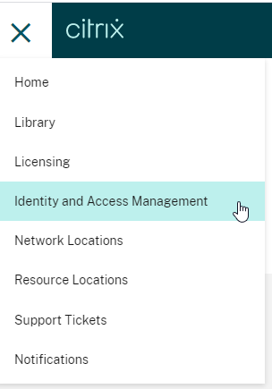

Then click on the "API Access" tab and you will see your Customer Id.

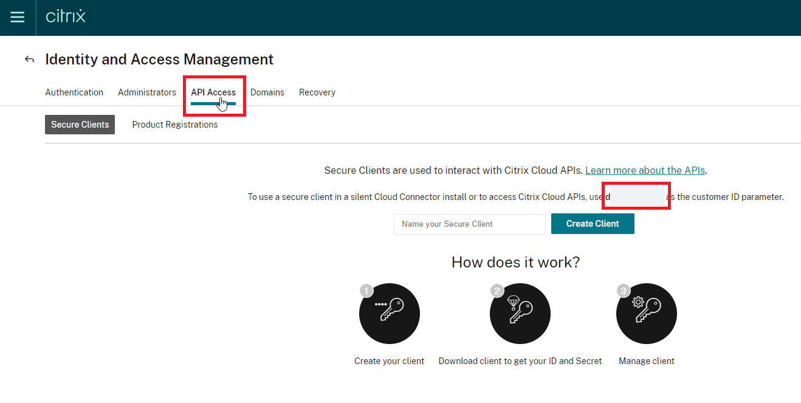

Now you need to create a client. 

Name your Secure Client, and then click "Create Client".

**Note:** Deleting a client can impact your integration with Citrix Cloud.

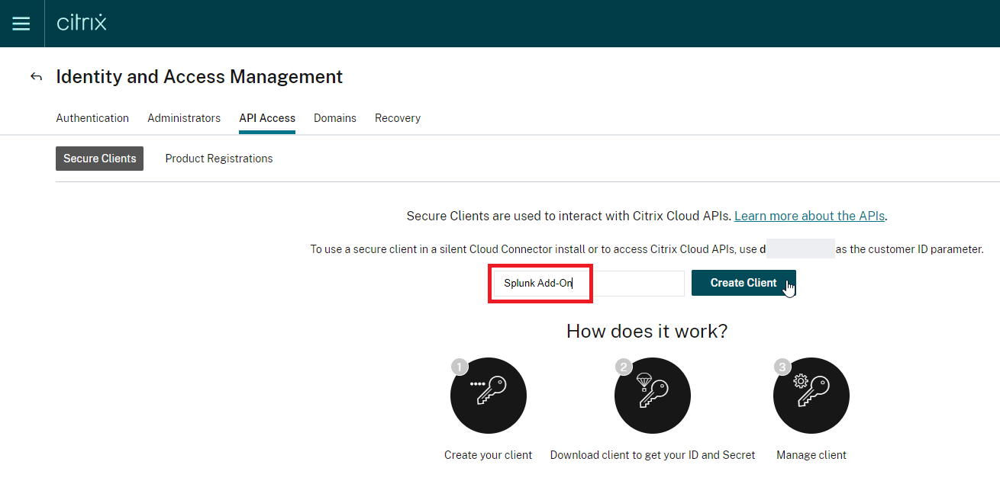

The following message appears, "ID and Secret have been created successfully". Download or copy the Client Id and Secret.

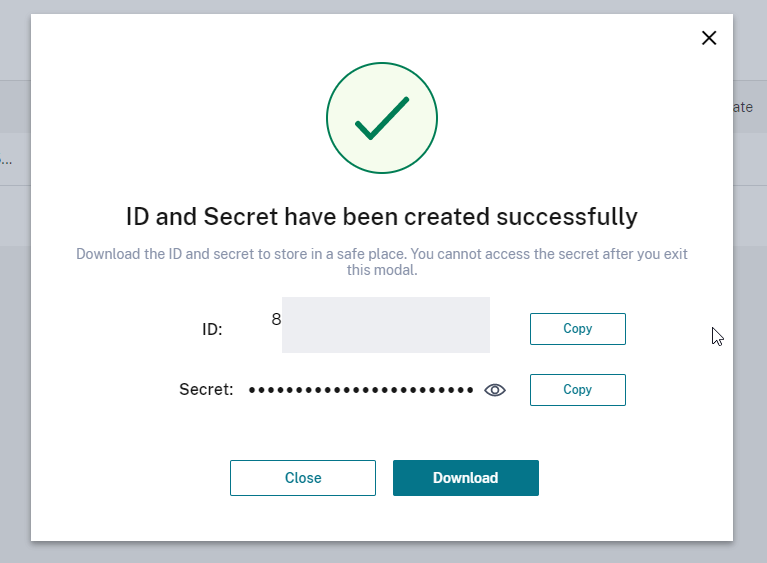

You should see the new client in the list as shown below.

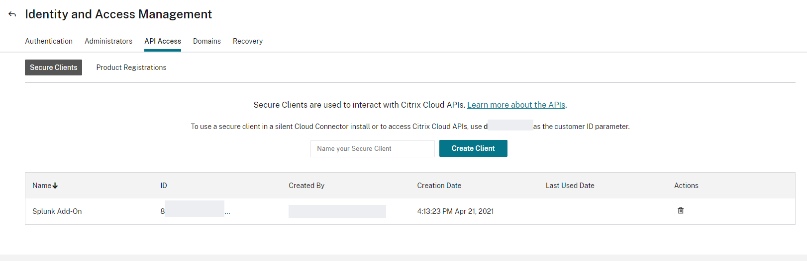

Once you have the Customer Id, Client Id and Client secret obtained from the Citrix Cloud, you can enter them into the "Configuration->Add-on Settings" in Splunk.

Then click "Save".

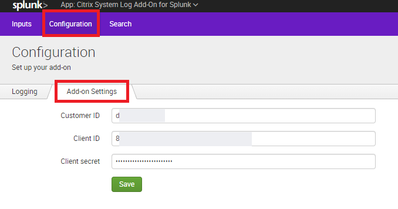

The Citrix System Log Add-On for Splunk does not create indexes automatically, so you have to create one manually.

Go to "Settings->Indexes".

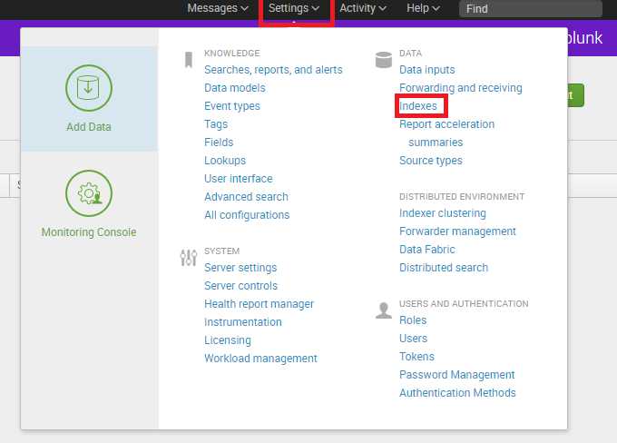

Click on "New Index"

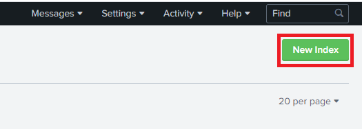

In the opened window enter the desired index name and configure all the other parameters as needed. 

Then click on "Save".

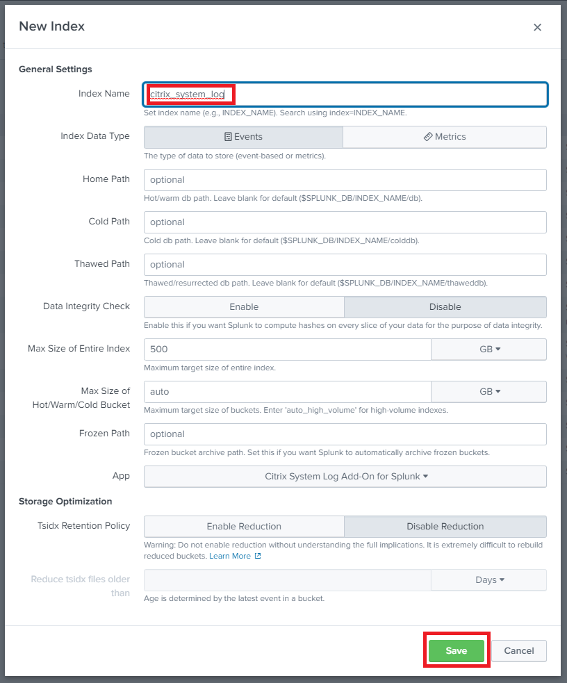

Go back to the Citrix System Log Add-On for Splunk and select "Inputs" then "Create New Input".

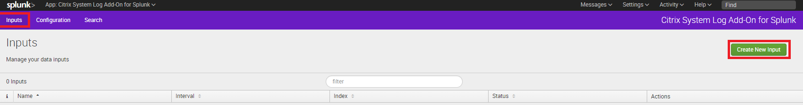

Enter name and desired interval on which the logs to be pulled from our system.

Select the index you just created.

**Note:** "Start Date" is suggested to leave as it is. There is a big chance to go away in a future version. 

Then click on "Add".

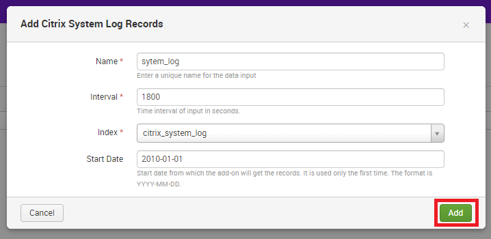

You will see the input created in the list.

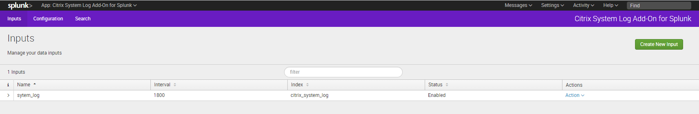
